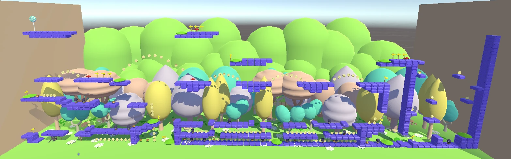

# The Coin Crusade
Oyun Programlama dersi vizesi için geliştirmiş olduğumuz Unity oyunu 

## Oynanış Bilgileri ve Bağlantı
Oyunumuz; şövalyemiz Aaron'ın önünde bulunan macerada, önüne çıkan coinleri toplayıp, aynı zamanda karşısına çıkan kötü karakterlerle savaşmasını konu alan 2.5D platformer oyunudur.

### Oynanış
* **Hareket**: Karakterinizi A,D veya yön tuşlarıyla sağa sola hareket ettirin.
* **Zıplama**: Yüksek yerlere çıkmak ya da engelleri aşmak için Boşluk (Space) tuşuna basın. Ayrıca bazı yerlerde bulunan yeşil mantarlarla kendinizi daha yükseğe fırlatın!
* **Saldırı**: Düşmanları yenmek için Sol Tık (Mouse Left Click) ile saldırı yapın.
* **Düşmanlara Dikkat**: Yol boyunca sizi engellemek için yerleştirilmiş düşmanlar olacak. Düşmanlardan kaçınmak için dikkatli bir şekilde hareket edin ve gerektiğinde sol clickle düşmanı etkisiz hale getirin!
* **Bonuslar**: Önünüze çıkan şeker (Belli bir süre boyunca hızı arttırır), tavşan (Çift zıplama özelliğini aktive eder), burger (Canınızı 1 arttırır) gibi bonuslarla güçlenin!
* **Altın Toplama**: 50 adet altına ulaştıktan sonra haritada bulunan tavşanı bulun ve çift zıplamanın tadını çıkarın! Unutmayın haritanın her yerine altınlar saçılmış halde!
* **Bitiş**: Lolipopa ulaşıp oyunu kazanın!

**Oyun Bağlantısı:** https://erenkose75.itch.io/the-coin-crusade

### Oyun İçi Nesneler

### Oyunumuzun Haritası:

## Üyelerin Kodladığı Aksiyonlar
### Eren Köse - 22360859075
* Coin nesnenin oyuncunun 10 birim yakınındayken kendi ekseni etrafında dönmesi ve yukarı aşağı haraket etmesi CoinScript.cs: 22
* Player nesnesinin Coin nesnesiyle teması sonucu Coin nesnesinin toplanması ve Player scriptindeki Coin sayacının arttırılması CoinScript.cs: 35
* Burger nesnesinin oyuncunun canı 3'den küçükse olduğu yerde büyüyüp küçülmesi BurgerScript.cs: 26
* Player nesnesinin Burger nesnesiyle teması sonucu Burger nesnesinin toplanıp Player scriptindeki Player canının arttırılması BurgerScript.cs: 38
* Candy nesnesinin Player tarafından alındıktan sonra 10 saniye boyunca X ve Y eksenlerinde sinüsel haraket (Titreşim) etmesi CandyScript.cs: 22
* Player nesnesinin Candy nesnesiyle teması sonucu hızının artması CandyScript.cs: 51

### Eren Güreli - 22360859016
* Player nesnesinin A,D veya yön tuşlarıyla X ekseni boyunca haraket etmesi PlayerScript.cs: 54
* Player nesnesinin Boşluk(Space) tuşu ile zıplaması ve yerçekimi etkisiyle yere düşmesi PlayerScript.cs: 64
* Player nesnesinin sol click ile saldırırması PlayerHitboxScript.cs: 6
* Enemy nesnesinin hareketleri EnemyScript.cs: 31
* Enemy nesnesinine çarpıldığında Player'ın canının azalması EnemyScript.cs: 60
* Enemy nesnesinin hızının coin sayısı başına 1.015 kat artması EnemyScript.cs: 34
* Oyuncu nesnesinin Lollipop nesnesiyle teması sonucu oyunun bitmesi LollipopScript.cs: 17

### Mustafa Aykut - 22360859028
* Kameranın oyuncuyu takip etmesi CameraScript.cs: 19
* Player nesnesi tarafından Candy nesnesi alındıktan sonra 10 saniye boyunca gece - gündüz döngüsünün yapılması PlayerScript.cs: 154
* Double Jump bonusu aktifse çift zıplama mekaniği PlayerScript.cs: 57
* Yeşil zıplama mantarına basılınca oyuncunun havaya fırlaması JumpingMushScript.cs: 6
* Player nesnesinin Candy nesnesiyle temasından sonra Candy nesneninin Disable olup 10 saniye sonra yeniden Enable olması CandyScript.cs: 60
* Oyuncu nesnesiyle Rabbit nesnesinin teması sonucu Rabbit nesnesinin toplanıp Double Jump özelliğinin aktif edilmesi RabbitScript.cs: 37
* Rabbit nesnesinin 50 coin toplandıktan sonra olduğu yerde zıplaması ve toplanabilir hâle gelmesi RabbitScript.cs: 24

## Referanslar
* Çevre Assetleri: https://fertile-soil-productions.itch.io/modular-platformer
* Karakter Assetleri: https://kaylousberg.itch.io/kaykit-adventurers
* Burger Assetleri: https://www.fab.com/listings/e4579c6c-2e83-460e-8295-621c843852d5
* Şeker Asseti: https://sketchfab.com/3d-models/cute-candy-f6e5e6e53988414185ca010572a54563
* Tavşan Asseti: https://assetstore.unity.com/packages/3d/characters/animals/white-rabbit-138709
